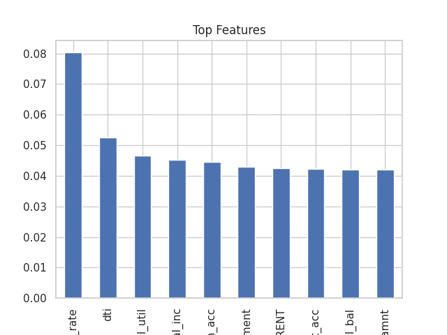

# 🏦 Loan Risk Prediction (Machine Learning Project)

## 📌 Overview

Built an end-to-end Machine Learning model to predict loan default risk using real-world financial data. The project focuses on identifying high-risk borrowers and improving decision-making in loan approvals.

---

## 🚀 Key Features

* Data cleaning & preprocessing
* Feature engineering (DTI, credit history, etc.)
* Handling class imbalance using SMOTE
* Model building using Logistic Regression & Random Forest
* Threshold tuning for business optimization
* Model evaluation using ROC-AUC, Precision, Recall

---

## 📊 Key Insights

* High debt-to-income ratio (DTI) strongly correlates with default risk
* Borrowers with past bankruptcies show higher risk
* Interest rate reflects borrower risk profile

---

## 📈 Model Performance

* Applied SMOTE to handle imbalance
* Optimized threshold to balance precision-recall trade-off
* Achieved strong performance in identifying risky borrowers

---

## 🛠 Tech Stack

* Python
* Pandas, NumPy
* Scikit-learn
* Matplotlib, Seaborn

---

## 📷 Visualizations

### Confusion Matrix

### ROC Curve

### Feature Importance

---

## 💼 Business Impact

This model can help financial institutions:

* Reduce loan defaults
* Improve credit risk assessment
* Make data-driven lending decisions

---

## 🔮 Future Improvements

* Hyperparameter tuning
* Deployment using FastAPI / Streamlit
* Integration with real-time data pipelines

---

## 👤 Author

Sneha
